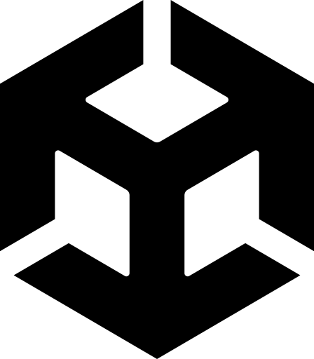
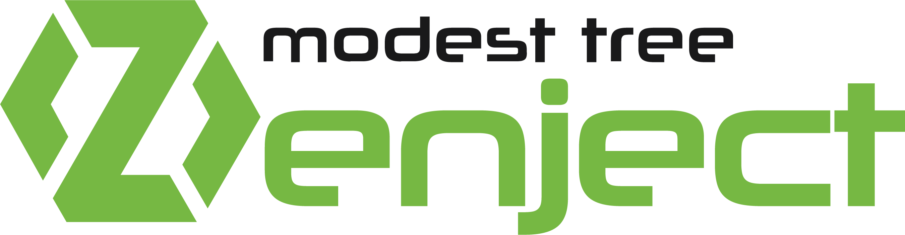
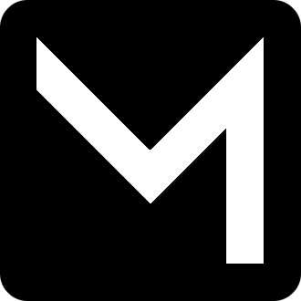

Hi there.

Welcome to my profile on github, here you can see information about my projects.

I just like programming but right now I'm mostly into **game development**.

Currently my main language is **C#** but I'm really interested in such languages as **C++**, **Rust**, **Python**, **JavaScript** and I'm going to learn them in future.

 **Unity:**

    <li>
         <b>Zenject</b> - Dependency injection framework
    </li>
    <li>
         <b>Mirror Networking</b> - Networking library for Unity
    </li>

<!-- *  Zenject - a dependency injection framework
*  Mirror Networking - networking library for Unity -->