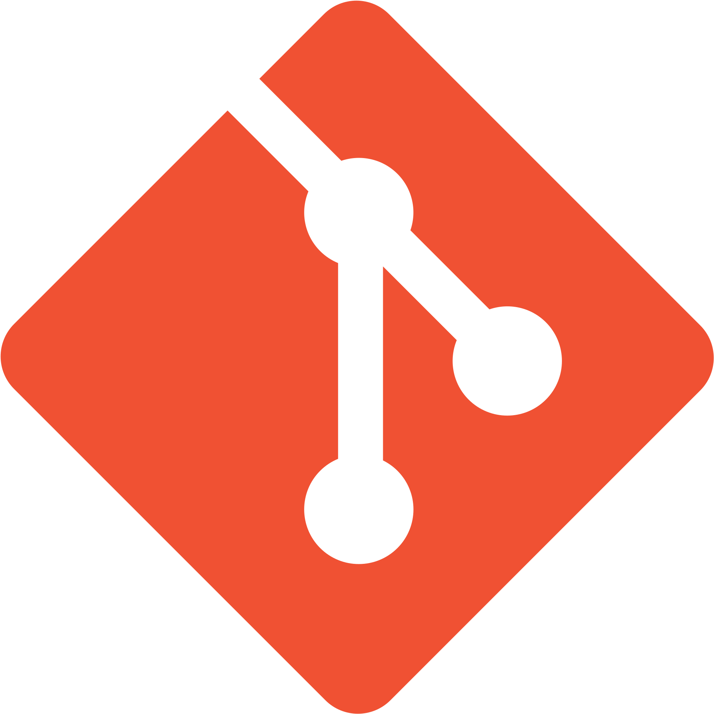

**Hi there.**

Welcome to my profile on github, here you can see information about me and my projects.

I'm learning as a Software Engineer. I just like programming but right now I'm mostly into **game development**.

Currently my main language is **C#** but I'm really interested in such languages as **C++**, **Rust**, **Python**, **JavaScript** and I'm going to learn them in the future.

---

**How you can reach me:**

 [**Eyellen**](https://discord.com/users/387921788551561238)

---

**Experience:**

**Languages:**

*  **C# Language**

*  **C++ Language**

**Version Control:**

*  **Git** - Version control system

*  **GitHub Desktop** - Git GUI client

**Databases:**

*  **MySQL**

*  **SQLite**

**Game Engines:**

*  **Unity Game Engine**

    *  **Zenject** - Dependency injection framework

    *  **Mirror Networking** - Networking library for Unity

*  **Unreal Engine**

    *  **Blueprints** - Visual scripting

**Software:**

*  **Blender** - 3D creation software
